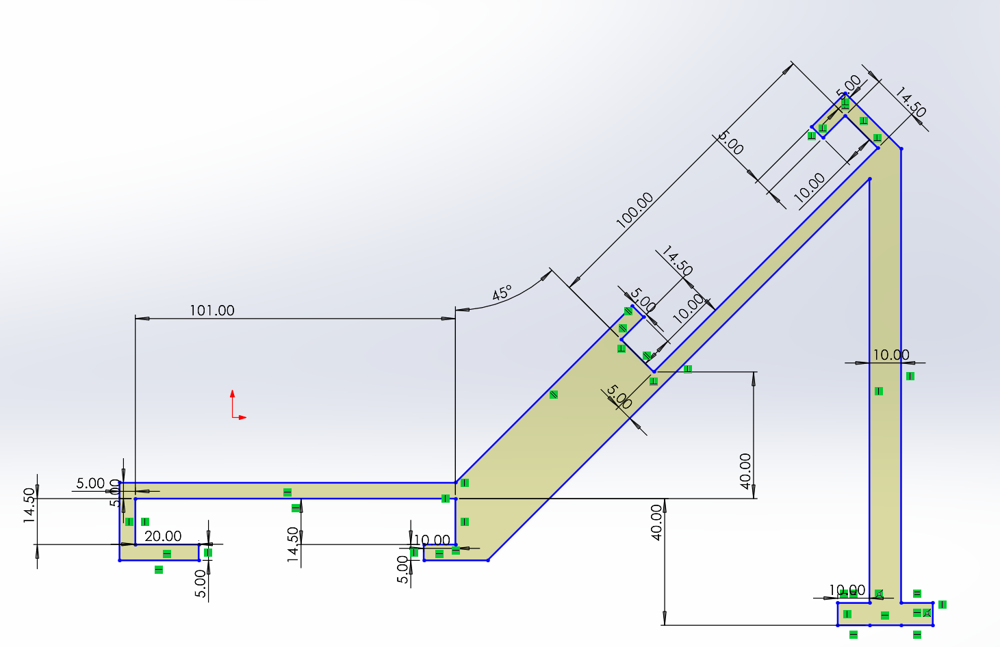
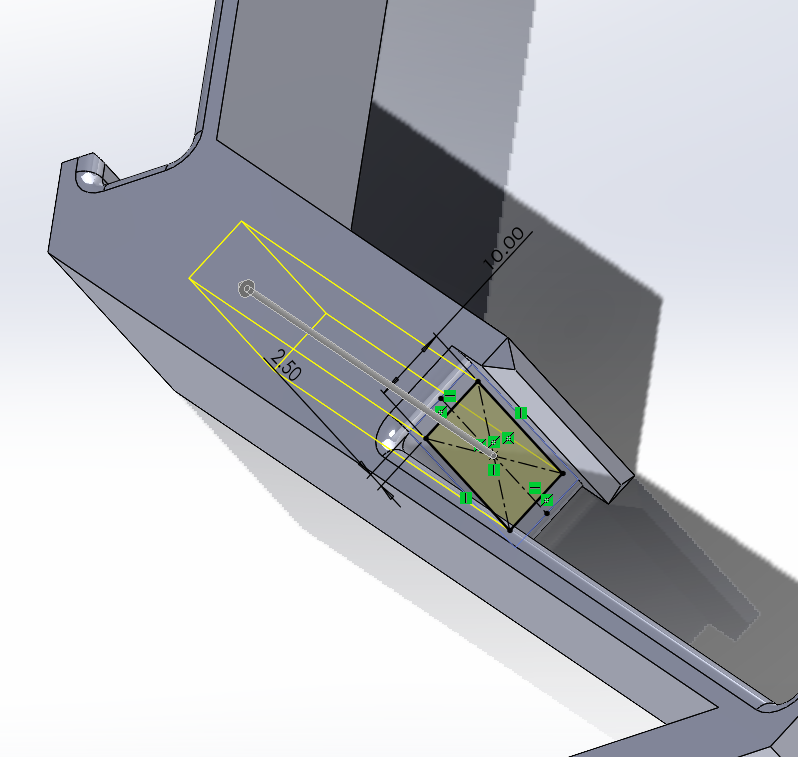
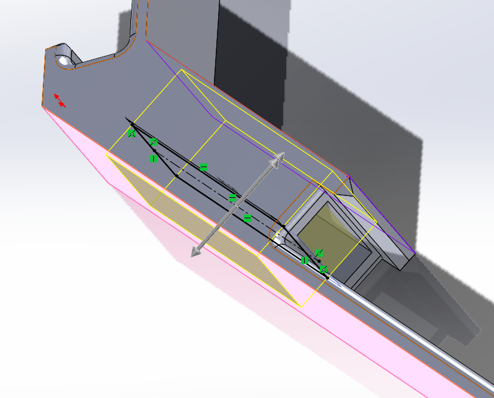

# Joycon to Switch mount

[Download STL](files/joyconSwitchMount.STL)

[Download STLPART](files/joyconSwitchMount.SLDPRT)

(I use solidworks 2022, 2022+ should be able to open/convert the file)

[Github link](https://github.com/AirplanegoBrr/3D-prints/joyconToSwitch)

(Github has more info and will show you step-by-step intructions)

This is my own version of a thing I saw on Thingiverse [Joycon grip to screen mount](https://www.thingiverse.com/thing:3135683) by `Davidcanflyy`

Their desgin (while nice) is missing a few things

1. You can't replace joycons when the switch is in
2. You can't charge the switch while using it
3. You can't set down the switch while its in the model without it tipping over

My desgin fixes these

# How to print

I printed this in PLA, 15% infill

Organic supports, placing a support box in the charger hold

[GCODE](files/joyconSwitchMount.gcode)

[3MF](files/joyconSwitchMount.3mf) (PrusaSlicer)

# Pictures

# How to use

## Insert joycon

1. Put the joycon side in with the model tited

2. Slide the model onto the joycon fully (you might have to bend the top of the clip to make it fit!)

3. Insert the joycons

## Inset switch

1. Line up the switch

1. Push the switch into the model, you might have to push the top clip to make it fit
**MAKE SURE TO PUSH DOWN THE VOLUME BUTTON IF YOU INSERT IT ON THE LEFT SIDE**

3. Line up the switch's charger port with the hole on the model

# How I desgined this

I use solidworks as my 3D model software, I just make it on its side and extruded it

